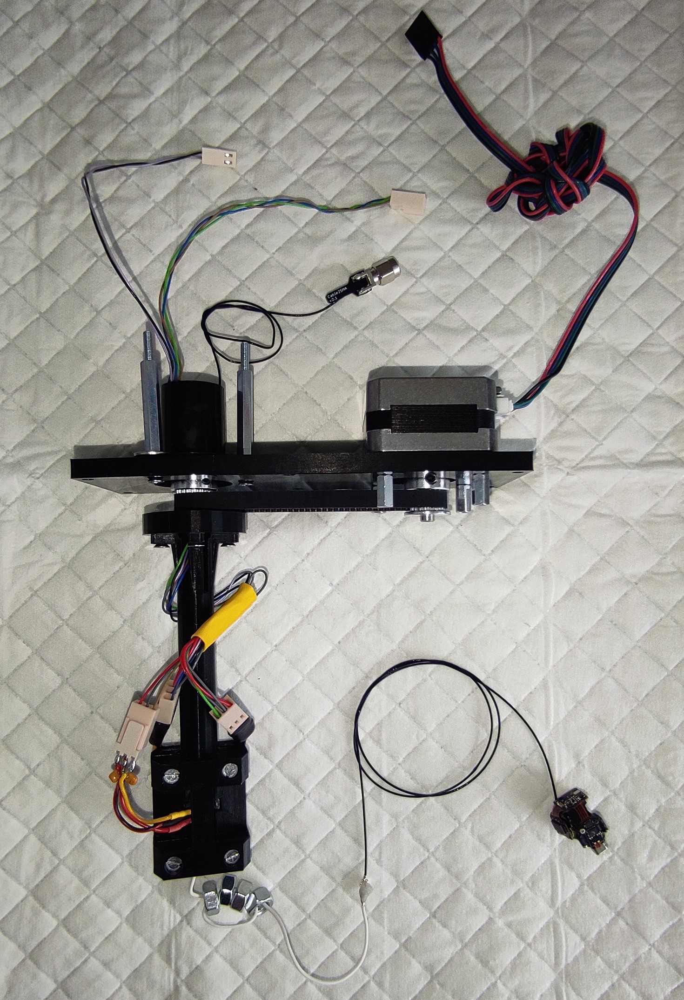
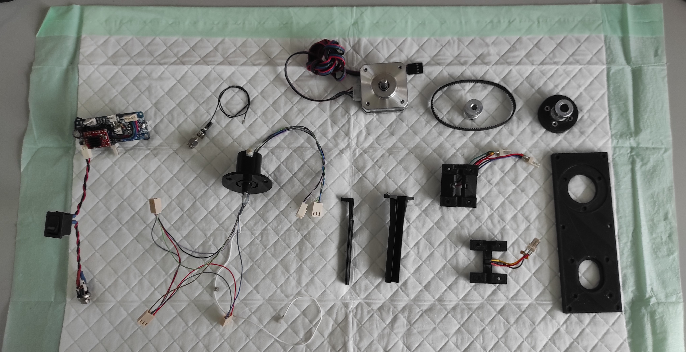

# FreiBoxCommutator_V2

We redesigned the 3D-printed FreiBox commutator to simplify assembly and reduce noise. The 3D-printed gears have been replaced with a timing pulley system.

Since the detection principle and Arduino code are the same as in v1, please refer to our previous version on GitHub. Don't forget to cite our paper:
- https://github.com/Optophys-Lab/FreiBox/tree/main/Commutator_FreiBox2022
- FreiBox: A Versatile Open-Source Behavioral Setup for Investigating the Neuronal Correlates of Behavioral Flexibility via 1-Photon Imaging in Freely Moving Mice
Brice De La Crompe, Megan Schneck, Florian Steenbergen, Artur Schneider, Ilka Diester
eNeuro 27 April 2023, 10 (4) ENEURO.0469-22.2023; DOI: 10.1523/ENEURO.0469-22.2023

/!\ Assembly Instructions: Before assembling the commutator, please check the file "FreiBoxCommutator_V2_AssemblyInstruction.pptx."

Feel free to share any ideas for improving the design! I would appreciate your feedback.

Note regarding the electronic circuit:
If you prefer not to solder the electronic circuit yourself, you can use a motor driver shield directly.

Brice.

